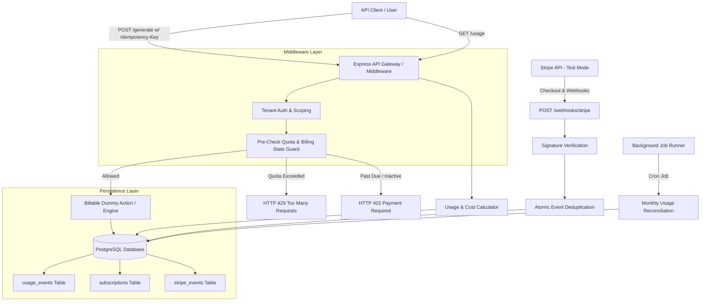
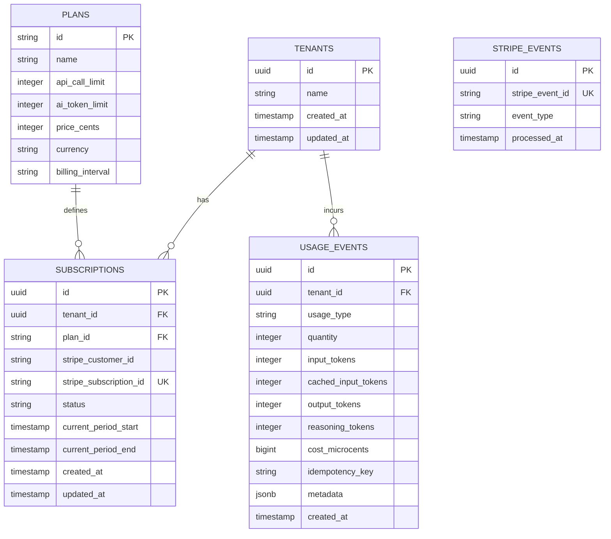
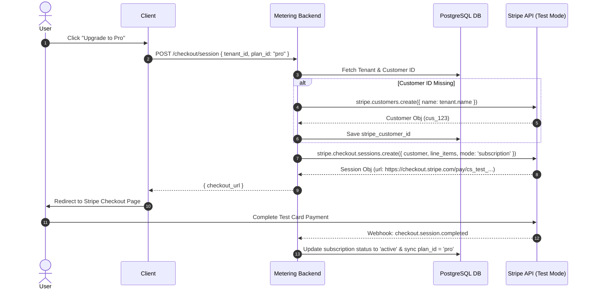

# DESIGN.md — Technical Architecture & System Design Blueprint
## LLM Usage Metering & Billing Engine

---

## A. Problem Statement
High-throughput SaaS platforms utilizing Large Language Models (LLMs) face significant financial and operational risks due to volatile API utilization and unpredictable token usage patterns. Traditional billing engines designed for fixed recurring subscriptions fail to handle multi-dimensional meterable metrics such as prompt tokens, cached prompt tokens, generated response tokens, and reasoning tokens.

Without an atomic metering infrastructure:
1. **Concurrent API Retries** result in double-counting usage events or overbilling customers.
2. **Race Conditions** during quota enforcement allow tenants to exceed usage limits before quota locks take effect.
3. **Floating-Point Financial Calculations** introduce rounding drift across millions of micro-transactions.
4. **Stripe Webhook Replays** or out-of-order events lead to inconsistent subscription states.

The **LLM Usage Metering & Billing Engine** provides a zero-drift, high-concurrency metering infrastructure that enforces real-time usage quotas *before* billable actions occur, tracks multi-token costs in exact integer micro-units, and maintains state synchronization with Stripe in Test Mode.

---

## B. Scope
The engine encompasses the following core functional components:
- **Multi-Tenant Metering**: Scoped tracking of two primary usage types: API calls and AI tokens (differentiating input, cached input, output, and reasoning tokens).
- **Pre-Execution Quota Guardrails**: Synchronous quota checks executed prior to performing billable tasks.
- **Idempotency Engine**: Guaranteeing exactly-once usage logging per `Idempotency-Key` under concurrent retries.
- **Integer Micro-Unit Financial Accounting**: Computing token and API costs using integer arithmetic (micro-cents / cents).
- **Stripe Integration (Test Mode)**: Customer creation, checkout session initialization, and subscription lifecycle management.
- **Robust Webhook Handling**: Cryptographic signature validation and atomic event deduplication.
- **Reconciliation Background Job**: Monthly usage rollup and period state sync.

---

## C. Explicit Non-Goals
To ensure tight alignment with project objectives, the following are explicitly out of scope:
- **Production Payment Processing**: No live credit card transactions; strictly Stripe Test Mode (`sk_test_*`).
- **Real LLM Model Hosting/Inference**: The system exposes dummy billable endpoints (`POST /generate`) and simulates token outputs without connecting to live OpenAI/Anthropic APIs.
- **Floating-Point Currency Storage**: Storing or computing money as IEEE 754 floating-point numbers (`0.1 + 0.2 != 0.3`) is strictly prohibited.
- **Client UI / Frontend**: The scope is strictly backend RESTful APIs and background job processing.
- **Multi-Region Distributed Locking**: Complex distributed consensus algorithms (e.g., Redis Redlock) are replaced by PostgreSQL's ACID transaction capabilities and unique constraints.

---

## D. Architecture & Layer Diagram



---

## E. Database Model

The database schema relies on PostgreSQL to enforce multi-tenant isolation, referential integrity, and atomic uniqueness constraints.



### Database Schema DDL (PostgreSQL)

```sql
-- Extension for UUID generation
CREATE EXTENSION IF NOT EXISTS "uuid-ossp";

-- 1. Tenants Table
CREATE TABLE tenants (
    id UUID PRIMARY KEY DEFAULT uuid_generate_v4(),
    name VARCHAR(255) NOT NULL,
    created_at TIMESTAMPTZ NOT NULL DEFAULT CURRENT_TIMESTAMP,
    updated_at TIMESTAMPTZ NOT NULL DEFAULT CURRENT_TIMESTAMP
);

-- 2. Plans Table
CREATE TABLE plans (
    id VARCHAR(50) PRIMARY KEY, -- 'free', 'pro'
    name VARCHAR(100) NOT NULL,
    api_call_limit INTEGER NOT NULL,
    ai_token_limit INTEGER NOT NULL,
    price_cents INTEGER NOT NULL, -- Integer money units (e.g. 4900 for $49.00)
    currency VARCHAR(3) NOT NULL DEFAULT 'usd',
    billing_interval VARCHAR(20) NOT NULL DEFAULT 'month'
);

-- Seed initial plans
INSERT INTO plans (id, name, api_call_limit, ai_token_limit, price_cents, currency) VALUES
('free', 'Free Plan', 1000, 100000, 0, 'usd'),
('pro', 'Pro Plan', 50000, 5000000, 4900, 'usd');

-- 3. Subscriptions Table
CREATE TABLE subscriptions (
    id UUID PRIMARY KEY DEFAULT uuid_generate_v4(),
    tenant_id UUID NOT NULL REFERENCES tenants(id) ON DELETE CASCADE,
    plan_id VARCHAR(50) NOT NULL REFERENCES plans(id),
    stripe_customer_id VARCHAR(255),
    stripe_subscription_id VARCHAR(255) UNIQUE,
    status VARCHAR(50) NOT NULL, -- 'active', 'past_due', 'canceled', 'unpaid', 'incomplete'
    current_period_start TIMESTAMPTZ NOT NULL,
    current_period_end TIMESTAMPTZ NOT NULL,
    created_at TIMESTAMPTZ NOT NULL DEFAULT CURRENT_TIMESTAMP,
    updated_at TIMESTAMPTZ NOT NULL DEFAULT CURRENT_TIMESTAMP
);

CREATE INDEX idx_subscriptions_tenant ON subscriptions(tenant_id);
CREATE INDEX idx_subscriptions_stripe_sub ON subscriptions(stripe_subscription_id);

-- 4. Usage Events Table
CREATE TABLE usage_events (
    id UUID PRIMARY KEY DEFAULT uuid_generate_v4(),
    tenant_id UUID NOT NULL REFERENCES tenants(id) ON DELETE CASCADE,
    usage_type VARCHAR(50) NOT NULL, -- 'api_call', 'ai_token'
    quantity INTEGER NOT NULL CHECK (quantity >= 0),
    input_tokens INTEGER NOT NULL DEFAULT 0,
    cached_input_tokens INTEGER NOT NULL DEFAULT 0,
    output_tokens INTEGER NOT NULL DEFAULT 0,
    reasoning_tokens INTEGER NOT NULL DEFAULT 0,
    cost_microcents BIGINT NOT NULL DEFAULT 0, -- Stored in 1/10000th of a cent
    idempotency_key VARCHAR(255) NOT NULL,
    metadata JSONB DEFAULT '{}'::jsonb,
    created_at TIMESTAMPTZ NOT NULL DEFAULT CURRENT_TIMESTAMP,
    CONSTRAINT uk_tenant_idempotency UNIQUE (tenant_id, idempotency_key)
);

CREATE INDEX idx_usage_tenant_period ON usage_events(tenant_id, created_at);
CREATE INDEX idx_usage_type ON usage_events(tenant_id, usage_type, created_at);

-- 5. Stripe Events Deduplication Table
CREATE TABLE stripe_events (
    id UUID PRIMARY KEY DEFAULT uuid_generate_v4(),
    stripe_event_id VARCHAR(255) NOT NULL UNIQUE,
    event_type VARCHAR(100) NOT NULL,
    processed_at TIMESTAMPTZ NOT NULL DEFAULT CURRENT_TIMESTAMP
);

CREATE INDEX idx_stripe_events_event_id ON stripe_events(stripe_event_id);
```

---

## F. API Surface

### 1. `POST /generate` (Dummy Billable Endpoint)
Simulates an LLM text generation request, validates usage limits, computes cost, and records usage idempotently.

- **Headers**:
  - `Content-Type: application/json`
  - `Idempotency-Key: <unique-uuid-v4-or-string>` (REQUIRED)
- **Request Body**:
```json
{
  "tenant_id": "3fa85f64-5717-4562-b3fc-2c963f66afa6",
  "prompt": "Summarize the quarterly financial report",
  "input_tokens": 1000,
  "cached_input_tokens": 200,
  "output_tokens": 500,
  "reasoning_tokens": 100
}
```
- **Response `200 OK`**:
```json
{
  "status": "success",
  "data": {
    "completion": "Simulated AI completion response text...",
    "usage": {
      "total_tokens": 1800,
      "input_tokens": 1000,
      "cached_input_tokens": 200,
      "output_tokens": 500,
      "reasoning_tokens": 100,
      "cost_microcents": 4310
    },
    "idempotency_key": "req-9921-abc-123",
    "replayed": false
  }
}
```
- **Error Responses**:
  - `400 Bad Request`: Missing `Idempotency-Key` header or invalid payload schema.
  - `402 Payment Required`: Subscription status is `past_due`, `canceled`, or `unpaid`.
  - `429 Too Many Requests`: Usage limit reached for current billing cycle.

---

### 2. `GET /usage`
Fetches current monthly usage statistics, quota limits, remaining balances, and accumulated costs for a tenant.

- **Query Parameters**:
  - `tenant_id`: UUID (REQUIRED)
- **Response `200 OK`**:
```json
{
  "tenant_id": "3fa85f64-5717-4562-b3fc-2c963f66afa6",
  "plan": "Pro Plan",
  "period": {
    "start": "2026-08-01T00:00:00.000Z",
    "end": "2026-09-01T00:00:00.000Z"
  },
  "metrics": {
    "api_calls": {
      "used": 1420,
      "limit": 50000,
      "remaining": 48580
    },
    "ai_tokens": {
      "used": 345000,
      "limit": 5000000,
      "remaining": 4655000,
      "breakdown": {
        "input_tokens": 200000,
        "cached_input_tokens": 45000,
        "output_tokens": 80000,
        "reasoning_tokens": 20000
      }
    }
  },
  "cost": {
    "amount_microcents": 588500,
    "amount_cents": 589,
    "formatted": "$5.89",
    "currency": "usd"
  }
}
```

---

### 3. `POST /checkout/session`
Initiates a Stripe Checkout session to upgrade a tenant to the Pro plan.

- **Request Body**:
```json
{
  "tenant_id": "3fa85f64-5717-4562-b3fc-2c963f66afa6",
  "plan_id": "pro",
  "success_url": "https://example.com/billing/success",
  "cancel_url": "https://example.com/billing/cancel"
}
```
- **Response `200 OK`**:
```json
{
  "checkout_url": "https://checkout.stripe.com/c/pay/cs_test_a1b2c3d4e5f6..."
}
```

---

### 4. `POST /webhooks/stripe`
Receives asynchronous status updates from Stripe.

- **Headers**:
  - `Stripe-Signature`: `<signature-string>`
- **Response `200 OK`**:
```json
{ "received": true }
```

---

## G. Idempotency Strategy

### The TOCTOU Flaw in Application-Level Checks
A naive implementation relies on checking existence prior to insertion:
```ts
// Flawed Approach
const existing = await db.query("SELECT * FROM usage_events WHERE idempotency_key = $1", [key]);
if (existing.rows.length > 0) {
  return existing.rows[0];
}
await db.query("INSERT INTO usage_events ...");
```
Under high concurrency (e.g., duplicate client retries arriving within milliseconds), multiple parallel requests execute the `SELECT` query before any process completes the `INSERT`. Both requests determine that the key is missing, execute the `INSERT`, and double-record usage events.

### Database-Level Unique Constraint Guarantee
The engine enforces absolute idempotency at the database engine level via a composite unique constraint:
`CONSTRAINT uk_tenant_idempotency UNIQUE (tenant_id, idempotency_key)`

When a request executes `POST /generate`:
1. The transaction attempts an `INSERT INTO usage_events (...) VALUES (...)`.
2. PostgreSQL atomically locks the index tuple for `(tenant_id, idempotency_key)`.
3. If a duplicate key arrives simultaneously, PostgreSQL aborts the second insert with code `23505` (`unique_violation`).
4. The backend catches `23505`, fetches the existing event, and returns the cached result with `"replayed": true`.

This eliminates race conditions and ensures **exactly-once usage execution**.

---

## H. Quota Enforcement Strategy

Quota checks are performed **synchronously inside a database transaction before billable execution**.

### Quota Evaluation Workflow
1. Fetch the tenant's current subscription and plan limits (`api_call_limit`, `ai_token_limit`).
2. Verify subscription status: If status is not `active`, reject immediately with **HTTP 402 Payment Required**.
3. Calculate current period usage:
   ```sql
   SELECT 
     COUNT(*) FILTER (WHERE usage_type = 'api_call') AS total_api_calls,
     COALESCE(SUM(quantity) FILTER (WHERE usage_type = 'ai_token'), 0) AS total_ai_tokens
   FROM usage_events
   WHERE tenant_id = $1
     AND created_at >= $2 -- subscription current_period_start
     AND created_at < $3  -- subscription current_period_end;
   ```
4. Evaluate requested usage:
   - `New_API_Calls = total_api_calls + 1`
   - `New_AI_Tokens = total_ai_tokens + (input_tokens + cached_input_tokens + output_tokens + reasoning_tokens)`
5. Quota Guard Decision:
   - If `New_API_Calls > api_call_limit` OR `New_AI_Tokens > ai_token_limit`, reject immediately with **HTTP 429 Too Many Requests**.

### Boundary Conditions Matrix

| Scenario | Usage Prior to Request | Limit | Requested Quantity | Result | New Usage Total | HTTP Code |
|---|---|---|---|---|---|---|
| **Limit - 1** | 999 API Calls | 1,000 | 1 API Call | **ALLOWED** | 1,000 API Calls | 200 OK |
| **Exact Limit** | 1,000 API Calls | 1,000 | 1 API Call | **BLOCKED** | 1,000 API Calls | 429 Too Many Requests |
| **Limit + 1 Attempt** | 1,000 API Calls | 1,000 | 1 API Call | **BLOCKED** | 1,000 API Calls | 429 Too Many Requests |
| **Partial Token Fit** | 99,500 Tokens | 100,000 | 1,000 Tokens | **BLOCKED** | 99,500 Tokens | 429 Too Many Requests |

---

## I. Cost Calculation Strategy

### Integer Financial Accounting
Floating-point math (`0.1 + 0.2 = 0.30000000000000004`) causes accumulative currency drift across large volumes of token events.
All costs are calculated and stored as **integer micro-cents**:
- **1 Cent = 10,000 Micro-Cents**
- **1 USD = 1,000,000 Micro-Cents ($1.00 = 100,000,000 Micro-Cents)**

### Pinned Pricing Rates (Configuration Pinned)

| Token Category | Price per 1M Tokens (USD) | Micro-Cents per 1 Token |
|---|---|---|
| **Input Tokens (Uncached)** | $1.25 | 125 micro-cents |
| **Cached Input Tokens** | $0.30 | 30 micro-cents |
| **Output Tokens** | $5.00 | 500 micro-cents |
| **Reasoning Tokens** | $5.00 (Priced as Output) | 500 micro-cents |
| **API Call Base Cost** | $0.001 per call | 100 micro-cents |

### Mathematical Pricing Formula
For a given request:
$$\text{Cost}_{\text{microcents}} = (\text{input\_tokens} \times 125) + (\text{cached\_input\_tokens} \times 30) + (\text{output\_tokens} \times 500) + (\text{reasoning\_tokens} \times 500)$$

$$\text{Total Billable Tokens} = \text{input\_tokens} + \text{cached\_input\_tokens} + \text{output\_tokens} + \text{reasoning\_tokens}$$

> [!NOTE]
> Reasoning tokens are explicitly treated and priced as **Output Tokens** ($5.00 / 1M tokens), preventing them from being ignored or incorrectly added into lower-priced input tiers.

---

## J. Stripe Checkout Flow



---

## K. Stripe Webhook Verification & Deduplication Strategy

### 1. Cryptographic Signature Verification
To prevent forged webhook attacks, raw request bodies are parsed before JSON deserialization and verified against the `STRIPE_WEBHOOK_SECRET`:
```ts
const event = stripe.webhooks.constructEvent(
  rawBody,
  signatureHeader,
  process.env.STRIPE_WEBHOOK_SECRET!
);
```
Invalid signatures immediately abort processing with **HTTP 400 Bad Request**.

### 2. Atomic Event Deduplication
Stripe guarantees at-least-once delivery, leading to potential duplicate webhooks. Deduplication is handled via the `stripe_events` table:

```ts
try {
  await db.query(
    "INSERT INTO stripe_events (stripe_event_id, event_type) VALUES ($1, $2)",
    [event.id, event.type]
  );
} catch (error) {
  if (error.code === '23505') { // Unique constraint violation
    return res.status(200).json({ received: true, note: "Duplicate event ignored" });
  }
  throw error;
}
```

### Required Webhook Events Handled

1. `checkout.session.completed`: Provisions initial subscription, links `stripe_subscription_id`, and upgrades plan to `pro`.
2. `customer.subscription.updated`: Syncs subscription status changes (`active`, `past_due`, `unpaid`), period dates (`current_period_start`, `current_period_end`), and plan upgrades/downgrades.
3. `customer.subscription.deleted`: Sets subscription status to `canceled` and resets tenant plan to `free`.

---

## L. Background Job Strategy

### Monthly Usage Reconciliation & Rollup Job
A background job runs on a periodic schedule (e.g. daily at midnight or at billing cycle resets):

- **Job Name**: `monthly-usage-reconciliation`
- **Schedule**: `0 0 1 * *` (First day of every month at midnight UTC)
- **Tasks Performed**:
  1. Identifies subscriptions whose billing period expired.
  2. Queries `usage_events` for the elapsed period and computes aggregated usage totals.
  3. Verifies local `current_period_start` and `current_period_end` against Stripe API subscription periods.
  4. Generates an internal reconciliation audit log for usage drift detection.
  5. Cleans up unneeded transient idempotency logs older than 90 days.

---

## M. Error & Status Code Strategy

| HTTP Status Code | Meaning | System Condition |
|---|---|---|
| **200 OK** | Success | Request processed cleanly or idempotent cached response returned. |
| **400 Bad Request** | Bad Syntax / Missing Headers | Invalid JSON, missing `Idempotency-Key` header, or invalid webhook signature. |
| **401 Unauthorized** | Unauthenticated | Missing or invalid API credentials. |
| **402 Payment Required** | Billing State Error | Tenant subscription status is `past_due`, `canceled`, or `unpaid`. |
| **404 Not Found** | Resource Missing | Non-existent tenant ID or unknown endpoint. |
| **429 Too Many Requests** | Quota Exceeded | API call limit or AI token limit reached for the current billing cycle. |
| **500 Internal Server Error** | Unexpected Failure | Database connectivity failure or unhandled exception. |

---

## N. Tenant Isolation Strategy

1. **Database Row Scoping**: All operational tables (`subscriptions`, `usage_events`) mandate a non-null `tenant_id` foreign key.
2. **Mandatory Query Filtering**: Every SQL query executed by the application explicitly binds `WHERE tenant_id = $1`. Cross-tenant queries are disallowed.
3. **Middleware Extraction**: The application middleware extracts `tenant_id` from authenticated contexts and enforces strict isolation before route handlers execute.

---

## O. Security & Secrets Strategy

1. **Environment Variable Isolation**: Secrets (`STRIPE_SECRET_KEY`, `STRIPE_WEBHOOK_SECRET`, `DATABASE_URL`) are read exclusively from environment variables.
2. **Repository Protection**: `.env` and sensitive local files are listed in `.gitignore` and must never be committed to Git.
3. **Log Sanitization**: Request loggers mask headers (`Authorization`, `Stripe-Signature`) and filter sensitive payload keys before outputting logs.
4. **Test Mode Enforcement**: Stripe API keys are validated on startup to ensure they use test mode prefixes (`sk_test_*`, `whsec_*`).

---

## P. Testing Strategy

1. **Unit Testing**:
   - Integer token pricing formula verification.
   - Quota limit boundary math (`limit - 1`, `limit`, `limit + 1`).
2. **Integration Testing**:
   - Database schema migrations and foreign key constraints.
   - End-to-end `POST /generate` and `GET /usage` execution flows.
3. **Concurrency & Idempotency Testing**:
   - Launching 50 parallel asynchronous HTTP POST requests with identical `Idempotency-Key` headers.
   - Verifying that exactly 1 database row is created and remaining 49 requests receive replayed 200 OK responses.
4. **Webhook Replay Testing**:
   - Replaying identical Stripe webhook events twice to ensure zero duplicate updates to tenant subscriptions.
